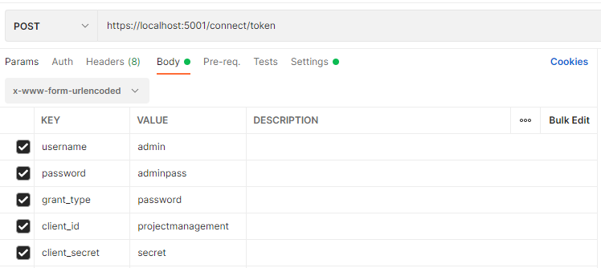
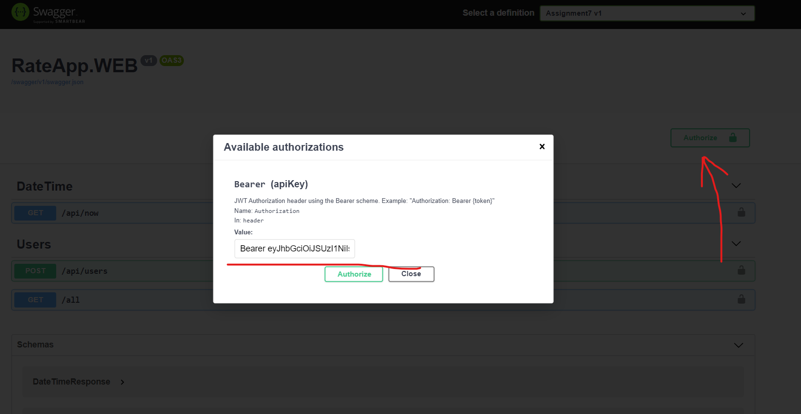

# Project Management App
***
Welcome to Midterm2' Project Management App.

[[_TOC_]]


## Instructions on obtaining token
- Using postman 




- Using c# RestSharp 
``` CSharp 
var client = new RestClient("https://localhost:5001/connect/token");
client.Timeout = -1;
var request = new RestRequest(Method.POST);
request.AddHeader("Content-Type", "application/x-www-form-urlencoded");
request.AddParameter("username", "admin");
request.AddParameter("password", "adminpass");
request.AddParameter("grant_type", "password");
request.AddParameter("client_id", "projectmanagement");
request.AddParameter("client_secret", "secret");
IRestResponse response = client.Execute(request);
Console.WriteLine(response.Content);
```

## Authorization

1. Copy the JWT
2. Go to the top right corner in swagger and click on Authorize
3. Type "Bearer", then follow with a space and the JWT 


***

4. Done

## The initial log in and further usage

1. You have two seeded users:

- Username: **admin**
- Password: **adminpass**

- Username: **manager**
- Password: **managerpass**

2. In order to create your first user you need to log in as admin

3. When you create a user you need to:

- Input their username
- Input their password
- Verify their password
- Input their first name
- Input their last name
- Input their role

**IMPORTANT** 

In order to select the role, you can choose from 3 options:

- Admin
- Manager
- Regular User

**If you do not submit the roles exactly as they are written, the program will return a response that such role does not exist!**

4. As an admin, you can:

- Create users
- Delete users
- Update users
- List Users (returns a list with all created users)

***
**You are authorized to all other roles' permissions**
***
**The only restriction as an admin is that you cannot create tasks and assign them to people who are not a part of the same team**
***

5. As a manager, you can

- Create teams
- Delete teams
- Edit teams
- List teams (returns a list with all created teams)
- Assign users to teams
- Delete users from teams

***
**You are authorized to the regular users' permissions**
***
**You cannot acccess the users menu**
***


6. As a regular user, you can:

- Create projects
- Assign teams to the projects you own
- Delete projects you own
- Update projects you own
- List project (returns a list with all created projects)
- ListMyProjects (returns a list with the projects that you currently own or you are part of a team that is assigned to them)

- Create tasks to projects you are part of and assign them to your team members
- Delete tasks from projects you are part of or own
- Update tasks from projects you are part of or own
- Reassign a task to a user that is your team member
- Get (returns a single task found by id)
- ListMyTasks (returns a list with the tasks which apply to you)

- Create worklogs to tasks you are assigned to
- Delete worklogs from tasks you are assigned to
- Edit worklogs from tasks you are assigned to
- Get (returns a single worklog find by id)


# 